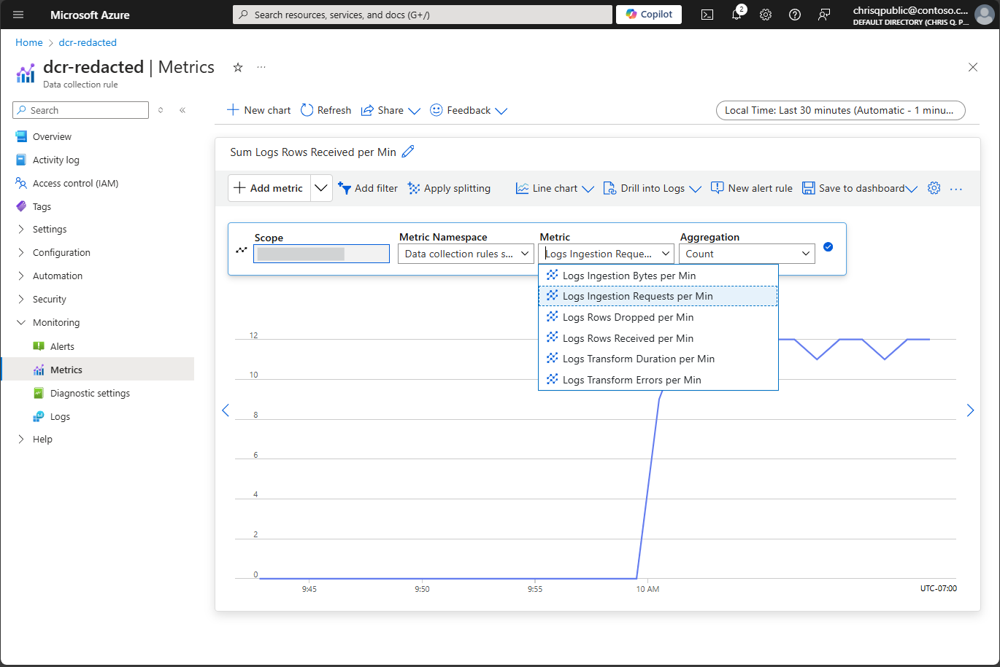
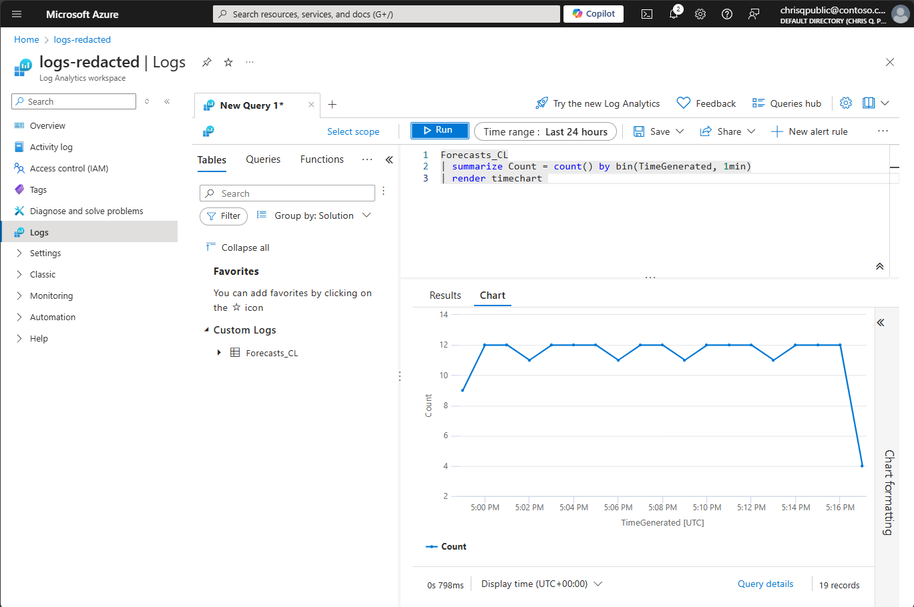

# AzLogs.Ingestion.Quickstart Sample

[](https://github.com/jcoliz/AzLogs.Ingestion.Quickstart/actions/workflows/build.yml)

This sample is a quick way to get started using the [Logs Ingestion API in Azure Monitor](https://learn.microsoft.com/en-us/azure/azure-monitor/logs/logs-ingestion-api-overview) on .NET 8.0.
The sample retrieves weather forecasts from the U.S. [National Weather Service API](https://www.weather.gov/documentation/services-web-api), then forwards them on to a [Logs Analytics Workspace](https://learn.microsoft.com/en-us/azure/azure-monitor/logs/log-analytics-workspace-overview) using a [Data Collection Rule](https://learn.microsoft.com/en-us/azure/azure-monitor/essentials/data-collection-rule-overview).

## Use case

Let's say we have some important data available in an external service, and we want some of that data in our Log Analytics Workspace. However, we don't control the external service, so we can't simply modify it to upload logs directly. What we can do instead is:

* **Extract** the data by calling the API it exposes, then send that data to a Data Collection Endpoint, which will
* **Transform** it into our desired schema using the Data Collection Rule, and
* **Load** it into a Log Analytics Workspace table.

## Prerequisites

In order to follow the instructions shown here, and run this sample, you will first need:

* An Azure Account. Set up a [Free Azure Account](https://azure.microsoft.com/en-us/pricing/purchase-options/azure-account) to get started.
* [Azure CLI tool with Bicep](https://learn.microsoft.com/en-us/azure/azure-resource-manager/bicep/install#azure-cli)

Please read through the [Logs Ingestion API in Azure Monitor](https://learn.microsoft.com/en-us/azure/azure-monitor/logs/logs-ingestion-api-overview) article carefully before proceeding.

## Register a Microsoft Entra app

The very first step is to [Register an application with the Microsoft Identity Platform](https://learn.microsoft.com/en-us/entra/identity-platform/quickstart-register-app?tabs=client-secret). 

From a PowerShell window in this folder, run the `Create-AppRegistration.ps1` script:

```dotnetcli
.\scripts\Create-AppRegistration -Name "azlogs-ingestion-quickstart"
```

After completion, this script will display configuration values you'll need later to configure the app, _e.g._

```toml
[Identity]
TenantId = "<tenant_id>"
AppId = "<client_id>"
AppSecret = "<client_secret>" 
```

Additionally, it will display the Service Principal ID needed when deploying Azure resources, next, _e.g._

```powershell
-ServicePrincipal <principal_id>
```

## Deploy Azure resources

This sample requires three Azure resources: Log Analytics Workspace, Data Collection Rule, and Data Collection Endpoint. There is an Azure Resource Manager (ARM) template here to set up everything you need, ready to go: [azlogs-ingestion.bicep](./.azure/deploy/azlogs-ingestion.bicep).
Be sure to clone this repo with submodules so you have the [AzDeploy.Bicep](https://github.com/jcoliz/AzDeploy.Bicep) project handy with the necessary module templates.

```powershell
git clone --recurse-submodules https://github.com/jcoliz/AzLogs.Ingestion.Quickstart.git
```

From a PowerShell window in this folder, run the `Deploy-Services.ps1 script`. Be sure to supply the `principal_id` for your app, from the previous step. Also, feel free to choose any resource group name and Azure data center location:

```dotnetcli
./scripts/Deploy-Services -ResourceGroup "azlogs-ingestion-quickstart" -Location "West US 2" -ServicePrincipal "<principal_id>"
```

After completion, this script will display configuration values you'll need in the next step, _e.g._

```toml
[LogIngestion]
EndpointUri = "<data_collection_endpoint_uri>" 
Stream = "<stream_name>" 
DcrImmutableId = "<data_collection_rule_id>"
```

## Configuration

Once you have deployed your Azure resources, you'll need to configure the sample with the App Registration you completed initially,
as well as the details on your Data Collection Rule. In this sample, we'll create a `config.toml` to contain these secrets in the [ConsoleApp](./ConsoleApp/) folder. This file will not be committed to source control.
To begin, copy the existing [config.template.toml](./ConsoleApp/config.template.toml) file to a new file named `config.toml`. Then fill this in with the values displayed from the scripts you ran earlier.

```toml
[Identity]
TenantId = "<tenant_id>" # Directory (tenant) ID
AppId = "<client_id>" # Application (client) ID
AppSecret = "<client_secret>" # Client secret value

[LogIngestion]
EndpointUri = "<data_collection_endpoint_uri>" # Data collection endpoint, be sure to include https://
Stream = "<stream_name>" # The stream name to send to, usually `Custom-<table>_CL`
DcrImmutableId = "<data_collection_rule_id>" # The Immutable ID for this Data Collection Rule 
```

## Run the sample

Now that your connection is configured, you can run the sample to see the log upload in action:

```powershell
dotnet run --project ConsoleApp

Press Ctrl-C to exit
OK. Received 14 forecasts
OK. Uploaded status 204
OK. Received 14 forecasts
OK. Uploaded status 204
OK. Received 14 forecasts
OK. Uploaded status 204
```

## Verify data flow

After observing that logs are sent successfully to Log Analytics from the client application logs, it's time to turn our attention
to verifying the data has landed correctly in the service. Using the Azure Portal, navigate to the resource group you created above, e.g. `azlogs-ingestion-quickstart`, then click into the Data Change Rule resource. In the navigation panel on the left, expand "Monitoring", then choose "Metrics". Click "Add Metric", then choose "Logs Ingestion Requests per Min". You should see a chart like the one below:



Next, we can look at the Log Analytics workspace itself to confirm that the logs have landed in their final destination. Again, navigate to the resource group page, but this time click into the Log Analytics resource. Click "Logs", and then enter this query:

```kql
Forecasts_CL
| summarize Count = count() by bin(TimeGenerated, 1min)
| render timechart 
```

If all is well, you will see a chart like the one below:



## Next step: Production

Congratulations, you have successfully ingested logs into a Log Analytics Workspace custom table using a Data Collection Rule!

Commonly this logic will be deployed as an Azure Function app. Please continue on to see the production-ready end-to-end sample of this same logic built as a function app: [AzLogs.Ingestion](https://github.com/jcoliz/AzLogs.Ingestion).
